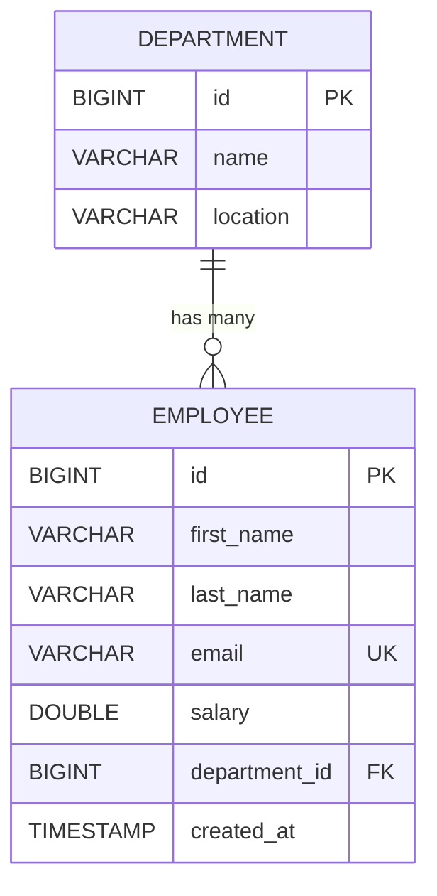

# 🏢 SpringBoot-JPA — Employee & Department Management API

> A hands-on, production-styled REST API built to master **Spring Boot 4**, **Spring Data JPA**, **Hibernate**, and clean layered architecture — using a real `Employee ↔ Department` relationship as the teaching vehicle.

<div align="center">


</div>

---

## 📚 Table of Contents

1. [Project Overview](#-project-overview)
2. [Learning Objectives](#-learning-objectives)
3. [Features](#-features)
4. [Tech Stack](#-tech-stack)
5. [Project Architecture](#-project-architecture)
6. [Folder Structure](#-folder-structure)
7. [Package-by-Package Breakdown](#-package-by-package-breakdown)
8. [Layer-by-Layer Explanation](#-layer-by-layer-explanation)
9. [Database Design](#-database-design)
10. [Entity Relationships Explained](#-entity-relationships-explained)
11. [Request Lifecycle](#-request-lifecycle)
12. [CRUD Flow](#-crud-flow)
13. [DTO Pattern](#-dto-pattern)
14. [Mapper Pattern](#-mapper-pattern)
15. [Repository Pattern](#-repository-pattern)
16. [Exception Handling](#-exception-handling)
17. [Hibernate Internals (As Used Here)](#-hibernate-internals-as-used-here)
18. [Annotation Reference](#-annotation-reference)
19. [API Documentation](#-api-documentation)
20. [Configuration Explained](#-configuration-explained)
21. [How to Run](#-how-to-run)
22. [Future Improvements](#-future-improvements)
23. [Learning Outcomes](#-learning-outcomes)
24. [Conclusion](#-conclusion)

---

## 🎯 Project Overview

This project is a **REST API that manages Employees and the Departments they belong to**. It intentionally keeps the domain small (two entities, one relationship) so that all the *engineering* around it — layering, DTOs, mapping, exception handling, Hibernate fetch behavior — stays front and center and easy to reason about.

**Why it exists:**
- To practice building a Spring Boot backend the way it's done in real teams — not a single fat controller, but Controller → Service → Mapper → Repository → Hibernate → PostgreSQL.
- To deliberately hit and understand classic JPA pitfalls (`LazyInitializationException`, N+1 queries, infinite JSON recursion) and fix them the correct way instead of hiding them.
- To serve as a reference implementation for the DTO + Mapper pattern in a project with a real relational link between two entities.

**What problem it solves:** it exposes a clean, safe HTTP interface over a relational Employee/Department schema — clients never see JPA entities directly, only well-defined DTOs.

**Concepts demonstrated:** layered architecture, `@OneToMany` / `@ManyToOne` bidirectional mapping, lazy loading, `JOIN FETCH` to avoid N+1 queries, manual DTO mapping, centralized exception handling via `@RestControllerAdvice`.

---

## 🧠 Learning Objectives

| Concept | Where it's demonstrated in this project |
|---|---|
| Spring Boot autoconfiguration | `SpringBootJpaApplication` bootstraps the entire app with a single `@SpringBootApplication` |
| Spring Data JPA | `EmployeeRepository` / `DepartmentRepository` extend `JpaRepository` — zero SQL written for basic CRUD |
| PostgreSQL integration | `application.properties` wires Hibernate to a real PostgreSQL instance via JDBC |
| DTO Pattern | `EmployeeRequestDTO`/`EmployeeResponseDTO` and their Department counterparts fully decouple the API contract from the entity model |
| Repository Pattern | Interfaces with **no implementation code** — Spring generates the proxy at runtime |
| Mapper Pattern | `EmployeeMapper` / `DepartmentMapper` — hand-written, explicit conversion logic (no MapStruct "magic") |
| Service Layer | `EmployeeServiceImpl` / `DepartmentServiceImpl` hold all business rules and orchestration |
| REST API design | Resource-oriented endpoints under `/api/employees` and `/api/departments` using proper HTTP verbs and status codes |
| Exception Handling | `GlobalExceptionHandler` centralizes error responses for the whole app |
| Hibernate | Entity lifecycle, dirty checking, lazy fetching, and cascading are all exercised by the two entities |
| Entity Relationships | A real bidirectional `@OneToMany`/`@ManyToOne` between `Department` and `Employee` |

---

## ✨ Features

| Feature | Description | Status |
|---|---|---|
| Employee CRUD | Create, read (single/all), update, delete employees | ✅ Implemented |
| Department CRUD | Create, read (single/all), update, delete departments | ✅ Implemented |
| Entity relationship | Every employee belongs to exactly one department; a department has many employees | ✅ Implemented |
| N+1-safe listing | `findAllWithDepartment()` uses `JOIN FETCH` so listing employees doesn't trigger one query per department | ✅ Implemented |
| Centralized error handling | `ResourceNotFoundException` → structured `404` JSON body | ✅ Implemented |
| Serialization safety | `@JsonIgnore` on `Employee.department` prevents infinite Department↔Employee JSON recursion | ✅ Implemented |
| Clean API contracts | Entities never leave the service layer; only DTOs cross the controller boundary | ✅ Implemented |
| Auto schema management | `ddl-auto=update` lets Hibernate create/evolve tables from entities | ✅ Implemented |
| SQL visibility for learning | `show-sql`, `format_sql`, and parameter bind logging enabled | ✅ Implemented |
| Input validation | Bean Validation (`@NotBlank`, `@Email`, etc.) | 🚧 Not yet implemented |
| Pagination & sorting | `Pageable` support on list endpoints | 🚧 Not yet implemented |
| API documentation UI | Swagger/OpenAPI | 🚧 Not yet implemented |
| Security | Spring Security / JWT | 🚧 Not yet implemented |
| Automated tests | Unit/integration tests beyond the default context-load test | 🚧 Not yet implemented |

---

## 🛠 Tech Stack

| Technology | Purpose | Where Used | Why Chosen |
|---|---|---|---|
| **Java 17** | Core language | Entire codebase | LTS version, required baseline for Spring Boot 4 |
| **Spring Boot 4.1.0** | Application framework & autoconfiguration | `SpringBootJpaApplication`, entire app | Removes boilerplate server/config setup, production-ready defaults |
| **Spring Web MVC** (`spring-boot-starter-webmvc`) | REST controller support, `DispatcherServlet` | `controller` package | Standard way to expose HTTP endpoints in Spring |
| **Spring Data JPA** | Repository abstraction over Hibernate | `repository` package | Eliminates boilerplate DAO code; generates queries from method names/interfaces |
| **Hibernate** (via Spring Data JPA) | ORM — maps Java objects to relational tables | `entity` package | Default and most mature JPA provider bundled with Spring Boot |
| **PostgreSQL** | Relational database | `application.properties` datasource | Robust, free, industry-standard RDBMS |
| **Lombok** | Removes getter/setter/constructor boilerplate | `entity`, `dto`, `exception` packages | Keeps entity/DTO classes short and readable |
| **Spring Boot DevTools** | Auto-restart on code change | Runtime only | Faster local development feedback loop |
| **Maven** | Build & dependency management | `pom.xml` | Standard Java build tool, deep Spring Boot integration |
| **JUnit 5** (`spring-boot-starter-webmvc-test`, `data-jpa-test`) | Testing framework | `src/test` | Default Spring Boot test starters (currently only a context-load smoke test is implemented) |

---

## 🏛 Project Architecture

The project follows a strict **layered architecture** — every request flows downward through well-defined layers, and every response flows back up through the same layers in reverse.

```
                ┌────────────┐
                │   Client   │   (Postman / Browser / Frontend)
                └─────┬──────┘
                      │ HTTP (JSON)
                      ▼
              ┌───────────────┐
              │  Controller   │  (@RestController)
              │  - validates path/body shape
              │  - delegates to Service
              │  - wraps result in ResponseEntity
              └───────┬───────┘
                      ▼
              ┌───────────────┐
              │   Service     │  (business logic + orchestration)
              │  - fetches related entities (e.g. Department)
              │  - enforces existence checks
              │  - calls Mapper + Repository
              └───────┬───────┘
                      ▼
              ┌───────────────┐
              │    Mapper     │  (DTO <-> Entity conversion)
              └───────┬───────┘
                      ▼
              ┌───────────────┐
              │  Repository   │  (JpaRepository interface)
              └───────┬───────┘
                      ▼
              ┌───────────────┐
              │ EntityManager │  (JPA persistence context)
              └───────┬───────┘
                      ▼
              ┌───────────────┐
              │   Hibernate   │  (SQL generation, dirty checking, caching)
              └───────┬───────┘
                      ▼
              ┌───────────────┐
              │      JDBC     │
              └───────┬───────┘
                      ▼
              ┌───────────────┐
              │  PostgreSQL   │
              └───────────────┘
```

> [!TIP]
> Notice the **Mapper** sits between Service and Repository conceptually, but in code it's invoked *by* the Service — the Service is the only layer that talks to both the Mapper and the Repository. This keeps Controllers and Repositories completely unaware of DTOs and mapping logic respectively.

---

## 📁 Folder Structure

```
SpringBoot-JPA/
├── pom.xml                                   # Maven build & dependency definitions
├── src/
│   ├── main/
│   │   ├── java/com/example/springbootjpa/
│   │   │   ├── SpringBootJpaApplication.java # Entry point (@SpringBootApplication)
│   │   │   │
│   │   │   ├── controller/                   # HTTP layer — receives requests, returns responses
│   │   │   │   ├── DepartmentController.java
│   │   │   │   └── EmployeeController.java
│   │   │   │
│   │   │   ├── service/                      # Business logic layer
│   │   │   │   ├── DepartmentService.java        (interface)
│   │   │   │   ├── DepartmentServiceImpl.java     (implementation)
│   │   │   │   ├── EmployeeService.java           (interface)
│   │   │   │   └── EmployeeServiceImpl.java       (implementation)
│   │   │   │
│   │   │   ├── repository/                   # Data access layer
│   │   │   │   ├── DepartmentRepository.java
│   │   │   │   └── EmployeeRepository.java
│   │   │   │
│   │   │   ├── entity/                       # JPA-managed domain model
│   │   │   │   ├── Department.java
│   │   │   │   └── Employee.java
│   │   │   │
│   │   │   ├── dto/                          # API contracts (request/response shapes)
│   │   │   │   ├── DepartmentRequestDTO.java
│   │   │   │   ├── DepartmentResponseDTO.java
│   │   │   │   ├── EmployeeRequestDTO.java
│   │   │   │   └── EmployeeResponseDTO.java
│   │   │   │
│   │   │   ├── util/                         # Entity <-> DTO conversion
│   │   │   │   ├── DepartmentMapper.java
│   │   │   │   └── EmployeeMapper.java
│   │   │   │
│   │   │   └── exception/                    # Centralized error handling
│   │   │       ├── ErrorResponse.java
│   │   │       ├── GlobalExceptionHandler.java
│   │   │       └── ResourceNotFoundException.java
│   │   │
│   │   └── resources/
│   │       └── application.properties        # Datasource, JPA/Hibernate, logging config
│   │
│   └── test/
│       └── java/com/example/springbootjpa/
│           └── SpringBootJpaApplicationTests.java  # Context-load smoke test
│
├── Notes/                                     # Personal learning notes (chapters)
└── Project-Docs/                              # Extended documentation (chapters)
```

---

## 📦 Package-by-Package Breakdown

### `controller`
**Purpose:** the only layer allowed to speak HTTP. Receives `@RequestBody`/`@PathVariable` input, calls exactly one service method per endpoint, and wraps the result in a `ResponseEntity` with the correct status code. Contains **zero business logic** — no lookups, no validation beyond what Spring MVC does automatically.

### `service`
**Purpose:** owns all business rules. Each entity gets an interface (`EmployeeService`, `DepartmentService`) plus an implementation (`EmployeeServiceImpl`, `DepartmentServiceImpl`). The interface exists so controllers depend on an abstraction, not a concrete class — this is what makes the service swappable/mockable in tests. `EmployeeServiceImpl` additionally depends on `DepartmentRepository` because creating/updating an Employee requires resolving its parent Department first.

### `repository`
**Purpose:** pure data access, expressed as interfaces extending `JpaRepository<Entity, ID>`. Spring Data generates the implementation at runtime via a dynamic proxy — there is no hand-written SQL or DAO class anywhere in this package except the one custom `@Query` in `EmployeeRepository`.

### `entity`
**Purpose:** the JPA-managed domain model that mirrors the database schema. `Department` and `Employee` are annotated with `@Entity`/`@Table` and carry the relationship annotations (`@OneToMany`, `@ManyToOne`) that Hibernate uses to generate foreign keys and joins.

### `dto`
**Purpose:** defines the shape of data that crosses the network boundary, decoupled from the entity model. Split into `*RequestDTO` (what the client sends) and `*ResponseDTO` (what the client receives) per entity — a deliberate asymmetry, since create/update payloads and read payloads rarely need the same fields (e.g. `EmployeeRequestDTO` carries a raw `departmentId`, while `EmployeeResponseDTO` carries a full nested `DepartmentResponseDTO`).

### `util`
**Purpose:** houses the hand-written mappers (`EmployeeMapper`, `DepartmentMapper`) that convert between DTOs and entities. Both are `final` classes with a private constructor and only `static` methods — they are stateless utility classes, not Spring beans.

### `exception`
**Purpose:** centralizes error handling so no controller method needs a `try/catch`. `ResourceNotFoundException` is a custom unchecked exception thrown by the service layer; `GlobalExceptionHandler` (a `@RestControllerAdvice`) intercepts it application-wide and converts it into a consistent `ErrorResponse` JSON body.

---

## 🔬 Layer-by-Layer Explanation

### Controller Layer
- **Purpose:** HTTP entry/exit point.
- **Dependencies:** the corresponding `*Service` interface only (injected via `@RequiredArgsConstructor`, i.e. constructor injection).
- **Example:** `EmployeeController.createEmployee()` receives an `EmployeeRequestDTO`, calls `employeeService.createEmployee(dto)`, and returns `201 Created` with the resulting `EmployeeResponseDTO`.

### Service Layer
- **Purpose:** business logic, cross-entity orchestration, existence checks.
- **Dependencies:** `Repository` interfaces + `Mapper` static methods.
- **Example:** `EmployeeServiceImpl.createEmployee()` must first resolve the `Department` from `dto.getDepartmentId()` — if it doesn't exist, it throws `ResourceNotFoundException` *before* ever touching `EmployeeRepository`.

### Repository Layer
- **Purpose:** persistence access.
- **Dependencies:** none of your own code — purely a Spring Data–generated proxy over Hibernate.
- **Example:** `employeeRepository.findAllWithDepartment()` runs a custom JPQL `JOIN FETCH` query instead of relying on lazy loading.

### DTO Layer
- **Purpose:** defines API request/response shape, independent of persistence structure.
- **Example:** `EmployeeRequestDTO.departmentId` (a `Long`) vs. `EmployeeResponseDTO.department` (a nested `DepartmentResponseDTO`) — the request only needs a foreign key, the response needs the full related object.

### Mapper Layer
- **Purpose:** explicit, readable conversion logic between DTO and Entity.
- **Example:** `EmployeeMapper.toEntity(dto, department)` takes the already-resolved `Department` (fetched by the Service) — the mapper itself never touches the database.

### Entity Layer
- **Purpose:** JPA-managed persistent objects mirroring database tables.
- **Example:** `Employee.department` is annotated `@ManyToOne(fetch = FetchType.LAZY)` + `@JoinColumn(name = "department_id")`, generating the `department_id` foreign key column on `employees`.

### Exception Layer
- **Purpose:** uniform error contract across the whole API.
- **Example:** any `ResourceNotFoundException` thrown anywhere in any service method is caught once, in one place, by `GlobalExceptionHandler`.

---

## 🗄 Database Design

### Entity-Relationship Diagram



### Table: `departments`

| Column | Type | Constraints | Notes |
|---|---|---|---|
| `id` | `BIGINT` | `PRIMARY KEY`, `IDENTITY` | Auto-incremented by PostgreSQL (`BIGSERIAL`-style) |
| `name` | `VARCHAR` | — | Department name (e.g. "Engineering") |
| `location` | `VARCHAR` | — | Physical/office location |

### Table: `employees`

| Column | Type | Constraints | Notes |
|---|---|---|---|
| `id` | `BIGINT` | `PRIMARY KEY`, `IDENTITY` | Auto-incremented |
| `first_name` | `VARCHAR(100)` | `NOT NULL` | Set via `@Column(nullable = false, length = 100)` |
| `last_name` | `VARCHAR(100)` | `NOT NULL` | Same as above |
| `email` | `VARCHAR` | `UNIQUE`, `NOT NULL` | Enforced at the DB level via `@Column(unique = true, nullable = false)` |
| `salary` | `DOUBLE PRECISION` | — | Nullable — no `@Column` constraint applied |
| `department_id` | `BIGINT` | `FOREIGN KEY → departments(id)` | Generated by the `@ManyToOne` + `@JoinColumn` pair |
| `created_at` | `TIMESTAMP` | — | Set manually in `EmployeeServiceImpl.createEmployee()` via `LocalDateTime.now()` |

> [!NOTE]
> Foreign key ownership sits on the **`employees`** side — this is why `department_id` lives on `employees` and not the other way around. In JPA terms, `Employee` is the **owning side** of the relationship, and `Department` is the **inverse (mappedBy) side**.

---

## 🔗 Entity Relationships Explained

```java
// Department.java — the "one" (inverse) side
@OneToMany(mappedBy = "department", cascade = CascadeType.ALL, fetch = FetchType.LAZY)
private List<Employee> employees;

// Employee.java — the "many" (owning) side
@ManyToOne(fetch = FetchType.LAZY)
@JoinColumn(name = "department_id")
private Department department;
```

| Concept | Meaning in this project |
|---|---|
| `@OneToMany` | One `Department` can be linked to many `Employee` rows. Declared on `Department.employees`. |
| `@ManyToOne` | Many `Employee` rows point back to a single `Department`. Declared on `Employee.department` — **this is the owning side**, because it holds the `@JoinColumn`. |
| `@JoinColumn(name = "department_id")` | Tells Hibernate to create a `department_id` foreign-key column on the `employees` table. |
| `mappedBy = "department"` | Tells Hibernate that `Department.employees` is **not** the owner — it just mirrors the relationship already defined by the `department` field on `Employee`. Without this, Hibernate would try to create a redundant join table. |
| `cascade = CascadeType.ALL` (on `Department.employees`) | If a `Department` is persisted/merged/removed, the same operation cascades to all of its `Employee`s. In practice: deleting a `Department` also deletes its employees. |
| `fetch = FetchType.LAZY` (both sides) | Neither side is loaded from the DB until explicitly accessed. This avoids pulling the entire employee list every time a department is fetched, and vice versa — critical for performance once relationships grow. |

> [!WARNING]
> Because `Employee.department` is lazy, **accessing it outside of an active Hibernate session throws `LazyInitializationException`.** This project avoids that failure mode entirely by (a) always mapping to a DTO *inside* the transactional service method, while the session is still open, and (b) using `JOIN FETCH` in `findAllWithDepartment()` for the list endpoint so the department is eagerly loaded in a single query.

---

## 🔄 Request Lifecycle

```
HTTP Request (e.g. POST /api/employees)
        │
        ▼
DispatcherServlet (Spring MVC front controller)
        │
        ▼
EmployeeController.createEmployee(EmployeeRequestDTO)
        │
        ▼
EmployeeServiceImpl.createEmployee(dto)
        │  ├─ departmentRepository.findById(dto.getDepartmentId())   → resolves parent Department
        │  ├─ EmployeeMapper.toEntity(dto, department)               → builds Employee entity
        │  ├─ employee.setCreatedAt(LocalDateTime.now())
        │  └─ employeeRepository.save(employee)
        ▼
EntityManager.persist(employee)
        │
        ▼
Hibernate — generates INSERT statement, applies dirty-checking rules
        │
        ▼
JDBC Driver → PostgreSQL
        │
        ▼
Hibernate returns managed Employee entity (now has generated ID)
        │
        ▼
EmployeeMapper.toDTO(savedEmployee)  → converts back to EmployeeResponseDTO
        │
        ▼
Controller wraps DTO in ResponseEntity<>(response, HttpStatus.CREATED)
        │
        ▼
JSON Response → Client
```

**Step-by-step explanation:**
1. **DispatcherServlet** routes the incoming request to the matching `@RestController` method based on URL + HTTP verb.
2. **Controller** deserializes the JSON body into an `EmployeeRequestDTO` (via Jackson) and delegates to the service — it does no business logic itself.
3. **Service** resolves any related entities (here, the `Department`), builds the entity via the **Mapper**, and calls the **Repository**.
4. **Repository/EntityManager/Hibernate** translate the save operation into SQL and execute it via **JDBC** against **PostgreSQL**.
5. The now-persisted entity (with its generated `id`) flows back up, gets mapped to a **Response DTO**, and is serialized to JSON by Spring MVC before being sent to the client.

---

## 🔁 CRUD Flow

### ➕ Create
`POST /api/employees` → Controller receives `EmployeeRequestDTO` → Service resolves `Department` by `departmentId` (throws `ResourceNotFoundException` if missing) → `EmployeeMapper.toEntity()` builds the entity → `createdAt` timestamp is stamped → `employeeRepository.save()` inserts the row → mapped back to `EmployeeResponseDTO` → `201 Created`.

### 📖 Read
- **Single:** `GET /api/employees/{id}` → `employeeRepository.findById(id)` → throws `ResourceNotFoundException` if absent → mapped to DTO → `200 OK`.
- **All:** `GET /api/employees` → `employeeRepository.findAllWithDepartment()` (custom `JOIN FETCH` query, avoiding N+1) → each row mapped to DTO → `200 OK`.

### ✏️ Update
`PUT /api/employees/{id}` → fetch existing `Employee` (404 if missing) → fetch the (possibly new) `Department` by `dto.getDepartmentId()` (404 if missing) → **mutate the managed entity's fields directly** (`setFirstName`, `setLastName`, etc.) → `employeeRepository.save()` → mapped to DTO → `200 OK`.

> [!TIP]
> Because the fetched `Employee` is a **managed entity** within the transaction, Hibernate's **dirty checking** would technically persist the field changes even without an explicit `save()` call at the next flush — but calling `save()` explicitly keeps the intent obvious and returns the same managed instance.

### 🗑 Delete
`DELETE /api/employees/{id}` → fetch existing `Employee` (404 if missing) → `employeeRepository.delete(employee)` → `200 OK` with a plain-text confirmation message.

---

## 📦 DTO Pattern

**Why DTOs exist:** entities are shaped by *database concerns* (foreign keys, lazy proxies, cascade rules); DTOs are shaped by *API concerns* (what the client actually needs to send/receive). Conflating the two causes real problems:

- Serializing `Employee` directly would try to serialize its lazy `department` field outside of a Hibernate session → `LazyInitializationException` or a broken proxy in the JSON output.
- Even with `@JsonIgnore`, returning the raw entity would leak internal fields never meant for the client and would couple the API's public contract to the database schema — a schema migration would silently change your API.

**How it's done here:** every entity gets a `*RequestDTO` (inbound shape) and `*ResponseDTO` (outbound shape) in the `dto` package. For example, `EmployeeRequestDTO` accepts a flat `departmentId: Long`, while `EmployeeResponseDTO` returns a fully nested `department: DepartmentResponseDTO` — the input and output shapes are intentionally different because a client creating an employee only knows the department's ID, but a client reading an employee wants the department's full detail.

---

## 🔀 Mapper Pattern

**Why manual mapping was used (instead of MapStruct/ModelMapper):** for a project this size, hand-written mappers are more transparent for learning — every field conversion is visible in one place, with no annotation processor magic to reverse-engineer.

**How it works:**
```java
// Request DTO → Entity  (needs the already-resolved Department passed in)
Employee employee = EmployeeMapper.toEntity(dto, department);

// Entity → Response DTO (recursively maps the nested Department too)
EmployeeResponseDTO response = EmployeeMapper.toDTO(savedEmployee);
```
Both `EmployeeMapper` and `DepartmentMapper` are `final` classes with a private constructor — enforcing that they are **stateless, static utility classes**, never meant to be instantiated or injected as beans.

**Advantages:** zero runtime reflection cost, fully debuggable with a standard breakpoint, and no annotation-processing build step required.

---

## 🗃 Repository Pattern

```java
public interface EmployeeRepository extends JpaRepository<Employee, Long> {
    @Query("SELECT e FROM Employee e JOIN FETCH e.department")
    List<Employee> findAllWithDepartment();
}
```

- **`JpaRepository<Employee, Long>`** already provides `save()`, `findById()`, `findAll()`, `deleteById()`, `count()`, `existsById()`, and more — with **no implementation code written by hand**.
- **How Spring generates the implementation:** at startup, Spring Data JPA creates a dynamic proxy class implementing `EmployeeRepository`, backed by `SimpleJpaRepository`, which internally delegates to the `EntityManager`.
- **Role of Hibernate:** translates each repository call into SQL, manages the **persistence context** (first-level cache), and performs **dirty checking** on managed entities.
- **Role of `EntityManager`:** the JPA-standard API that Hibernate implements — `save()` ultimately calls `entityManager.persist()` or `entityManager.merge()` depending on entity state.
- **The one custom method**, `findAllWithDepartment()`, exists specifically to solve the **N+1 query problem** (see [Hibernate Internals](#-hibernate-internals-as-used-here)) — it fetches every `Employee` and its `Department` in a **single SQL query** using `JOIN FETCH`.

---

## 🚨 Exception Handling

```java
@RestControllerAdvice
public class GlobalExceptionHandler {
    @ExceptionHandler(ResourceNotFoundException.class)
    public ResponseEntity<ErrorResponse> handleResourceNotFound(ResourceNotFoundException ex) {
        ErrorResponse error = new ErrorResponse(LocalDateTime.now(), HttpStatus.NOT_FOUND.value(), ex.getMessage());
        return new ResponseEntity<>(error, HttpStatus.NOT_FOUND);
    }
}
```

| Component | Role |
|---|---|
| `ResourceNotFoundException` | A custom unchecked (`RuntimeException`) exception thrown by services whenever `findById()`/`orElseThrow()` fails to find a row — used identically for missing Employees *and* missing Departments. |
| `ErrorResponse` | A simple immutable record-like DTO (`timestamp`, `status`, `message`) representing the JSON error body sent to the client. |
| `GlobalExceptionHandler` | A `@RestControllerAdvice` — intercepts exceptions thrown by **any** `@RestController` in the app, so no individual controller method needs its own `try/catch`. |

**Why centralize it:** without this, every controller method would need repetitive `try { ... } catch (ResourceNotFoundException e) { ... }` blocks. Centralizing the mapping from exception → HTTP response keeps controllers focused purely on the happy path, and guarantees a **consistent error JSON shape** across the entire API.

**Example error response** (`GET /api/employees/999` when no such employee exists):
```json
{
  "timestamp": "2026-07-06T10:15:30",
  "status": 404,
  "message": "Employee not found with ID: 999"
}
```

---

## ⚙️ Hibernate Internals (As Used Here)

| Concept | How it shows up in this project |
|---|---|
| **Entity Lifecycle** | An `Employee` becomes *managed* the moment `employeeRepository.save()` or `findById()` returns it; it stays managed for the rest of the transaction. |
| **Persistence Context** | The first-level cache for the current transaction — calling `findById()` twice for the same ID within one transaction returns the same in-memory instance. |
| **Dirty Checking** | In `updateEmployee()`/`updateDepartment()`, fields are mutated directly on the fetched managed entity (`employee.setFirstName(...)`) — Hibernate detects these changes automatically at flush time and generates an `UPDATE` statement. |
| **Flush** | Happens automatically at transaction commit (or before certain queries) — it's when Hibernate actually sends the pending SQL to PostgreSQL. |
| **Fetch Types** | Both `Employee.department` and `Department.employees` use `FetchType.LAZY` — related data is only loaded when explicitly accessed or explicitly fetched via `JOIN FETCH`. |
| **Cascade Types** | `Department.employees` uses `CascadeType.ALL` — deleting/persisting a `Department` cascades to its `Employee`s. |
| **`LazyInitializationException`** | Would occur if code tried to access `employee.getDepartment().getName()` *after* the Hibernate session/transaction closed. Avoided here because all entity-to-DTO mapping happens inside the transactional service method. |
| **N+1 Query Problem** | Would occur if `GET /api/employees` used `findAll()` and then lazily touched `.getDepartment()` for each employee — that's 1 query for the list + N queries for each department. Solved by `findAllWithDepartment()`'s `JOIN FETCH`, which does it in **one** query. |

---

## 🏷 Annotation Reference

| Annotation | Purpose | Used In |
|---|---|---|
| `@SpringBootApplication` | Enables autoconfiguration, component scanning, and configuration properties | `SpringBootJpaApplication` |
| `@RestController` | Marks a class as a controller whose return values are serialized directly to the HTTP response body | `EmployeeController`, `DepartmentController` |
| `@RequestMapping("/api/...")` | Defines the base URL path for all endpoints in the controller | Both controllers |
| `@GetMapping` / `@PostMapping` / `@PutMapping` / `@DeleteMapping` | Map HTTP verbs to specific handler methods | Both controllers |
| `@PathVariable` | Binds a URL path segment (e.g. `{id}`) to a method parameter | `getEmployeeById`, `updateEmployee`, `deleteEmployee`, etc. |
| `@RequestBody` | Deserializes the incoming JSON request body into a DTO | `createEmployee`, `updateEmployee`, etc. |
| `@Service` | Marks a class as a Spring-managed service bean | `EmployeeServiceImpl`, `DepartmentServiceImpl` |
| `@Repository` | Marks an interface as a Spring Data repository bean (also enables JPA exception translation) | `EmployeeRepository`, `DepartmentRepository` |
| `@RequiredArgsConstructor` (Lombok) | Generates a constructor for all `final` fields — used for constructor injection | Controllers, service implementations |
| `@Entity` | Marks a class as a JPA-managed persistent entity | `Employee`, `Department` |
| `@Table(name = "...")` | Explicitly names the backing database table | `Employee`, `Department` |
| `@Id` | Marks the primary key field | `Employee.id`, `Department.id` |
| `@GeneratedValue(strategy = GenerationType.IDENTITY)` | Delegates PK generation to the database's auto-increment column | `Employee.id`, `Department.id` |
| `@Column(name, nullable, length, unique)` | Customizes the mapped column's name and DB constraints | `Employee.firstName`, `.lastName`, `.email`, `.createdAt` |
| `@OneToMany(mappedBy, cascade, fetch)` | Declares the inverse side of a one-to-many relationship | `Department.employees` |
| `@ManyToOne(fetch)` | Declares the owning side of a many-to-one relationship | `Employee.department` |
| `@JoinColumn(name = "department_id")` | Specifies the foreign-key column name on the owning side | `Employee.department` |
| `@JsonIgnore` (Jackson) | Excludes a field from JSON serialization, preventing infinite recursion in bidirectional relationships | `Employee.department` |
| `@RestControllerAdvice` | Declares a global, cross-cutting exception handler for all `@RestController`s | `GlobalExceptionHandler` |
| `@ExceptionHandler` | Binds a method to handle a specific exception type | `GlobalExceptionHandler.handleResourceNotFound` |
| `@Getter` / `@Setter` (Lombok) | Generates getters/setters | `Employee`, `Department`, `ErrorResponse` |
| `@NoArgsConstructor` / `@AllArgsConstructor` (Lombok) | Generates no-args and all-args constructors (JPA requires a no-args constructor) | `Employee`, `Department` |
| `@Builder` (Lombok) | Generates a fluent builder — used heavily by the Mapper classes | `Employee`, `Department`, `EmployeeResponseDTO`, `DepartmentResponseDTO` |
| `@Data` (Lombok) | Shorthand for `@Getter` + `@Setter` + `@ToString` + `@EqualsAndHashCode` + a required-args constructor | Request DTOs (`EmployeeRequestDTO`, `DepartmentRequestDTO`) |

---

## 📡 API Documentation

### Department Endpoints — `/api/departments`

<details>
<summary><b>POST /api/departments</b> — Create a Department</summary>

**Request Body:**
```json
{
  "name": "Engineering",
  "location": "Pune"
}
```
**Response:** `201 Created`
```json
{
  "id": 1,
  "name": "Engineering",
  "location": "Pune"
}
```
</details>

<details>
<summary><b>GET /api/departments/{id}</b> — Get Department by ID</summary>

**Response:** `200 OK`
```json
{ "id": 1, "name": "Engineering", "location": "Pune" }
```
**Response:** `404 Not Found` (if ID doesn't exist)
```json
{ "timestamp": "2026-07-06T10:15:30", "status": 404, "message": "Department not found with ID: 99" }
```
</details>

<details>
<summary><b>GET /api/departments</b> — Get All Departments</summary>

**Response:** `200 OK`
```json
[
  { "id": 1, "name": "Engineering", "location": "Pune" },
  { "id": 2, "name": "HR", "location": "Mumbai" }
]
```
</details>

<details>
<summary><b>PUT /api/departments/{id}</b> — Update a Department</summary>

**Request Body:**
```json
{ "name": "Engineering", "location": "Bangalore" }
```
**Response:** `200 OK`
```json
{ "id": 1, "name": "Engineering", "location": "Bangalore" }
```
</details>

<details>
<summary><b>DELETE /api/departments/{id}</b> — Delete a Department</summary>

**Response:** `200 OK`
```
Department deleted successfully.
```
> [!WARNING]
> Because `Department.employees` cascades with `CascadeType.ALL`, deleting a Department also deletes every Employee linked to it.
</details>

| Method | URL | Status Codes |
|---|---|---|
| `POST` | `/api/departments` | `201`, `500` |
| `GET` | `/api/departments/{id}` | `200`, `404` |
| `GET` | `/api/departments` | `200` |
| `PUT` | `/api/departments/{id}` | `200`, `404` |
| `DELETE` | `/api/departments/{id}` | `200`, `404` |

---

### Employee Endpoints — `/api/employees`

<details>
<summary><b>POST /api/employees</b> — Create an Employee</summary>

**Request Body:**
```json
{
  "firstName": "Saad",
  "lastName": "Khan",
  "email": "saad.khan@example.com",
  "salary": 75000,
  "departmentId": 1
}
```
**Response:** `201 Created`
```json
{
  "id": 10,
  "firstName": "Saad",
  "lastName": "Khan",
  "email": "saad.khan@example.com",
  "salary": 75000,
  "createdAt": "2026-07-06T10:20:00",
  "department": { "id": 1, "name": "Engineering", "location": "Pune" }
}
```
**Response:** `404 Not Found` (if `departmentId` doesn't exist)
```json
{ "timestamp": "2026-07-06T10:20:00", "status": 404, "message": "Department not found with ID: 1" }
```
</details>

<details>
<summary><b>GET /api/employees/{id}</b> — Get Employee by ID</summary>

**Response:** `200 OK`
```json
{
  "id": 10,
  "firstName": "Saad",
  "lastName": "Khan",
  "email": "saad.khan@example.com",
  "salary": 75000,
  "createdAt": "2026-07-06T10:20:00",
  "department": { "id": 1, "name": "Engineering", "location": "Pune" }
}
```
</details>

<details>
<summary><b>GET /api/employees</b> — Get All Employees (with Department, N+1-safe)</summary>

**Response:** `200 OK`
```json
[
  {
    "id": 10,
    "firstName": "Saad",
    "lastName": "Khan",
    "email": "saad.khan@example.com",
    "salary": 75000,
    "createdAt": "2026-07-06T10:20:00",
    "department": { "id": 1, "name": "Engineering", "location": "Pune" }
  }
]
```
</details>

<details>
<summary><b>PUT /api/employees/{id}</b> — Update an Employee</summary>

**Request Body:**
```json
{
  "firstName": "Saad",
  "lastName": "Khan",
  "email": "saad.khan@example.com",
  "salary": 85000,
  "departmentId": 2
}
```
**Response:** `200 OK` — returns the updated `EmployeeResponseDTO`, including the new department.
</details>

<details>
<summary><b>DELETE /api/employees/{id}</b> — Delete an Employee</summary>

**Response:** `200 OK`
```
Employee deleted successfully
```
</details>

| Method | URL | Status Codes |
|---|---|---|
| `POST` | `/api/employees` | `201`, `404` |
| `GET` | `/api/employees/{id}` | `200`, `404` |
| `GET` | `/api/employees` | `200` |
| `PUT` | `/api/employees/{id}` | `200`, `404` |
| `DELETE` | `/api/employees/{id}` | `200`, `404` |

---

## ⚙️ Configuration Explained

`src/main/resources/application.properties`:

| Property | Value | Why it exists |
|---|---|---|
| `spring.application.name` | `SpringBoot-JPA` | Identifies the app (shows up in logs, Actuator, etc.) |
| `spring.datasource.url` | `jdbc:postgresql://localhost:5432/springboot_jpa` | Points Spring Boot at the local PostgreSQL database `springboot_jpa` |
| `spring.datasource.username` / `password` | `postgres` / *(set locally)* | Database credentials |
| `spring.datasource.driver-class-name` | `org.postgresql.Driver` | Explicitly declares the JDBC driver (usually auto-detected, but stated here for clarity) |
| `spring.jpa.hibernate.ddl-auto` | `update` | Tells Hibernate to auto-create/alter tables to match entities **without** dropping existing data — convenient for learning, **not** for production |
| `spring.jpa.show-sql` | `true` | Prints every generated SQL statement to the console |
| `spring.jpa.properties.hibernate.format_sql` | `true` | Pretty-prints that SQL instead of a single line |
| `spring.jpa.properties.hibernate.use_sql_comments` | `true` | Adds a comment above each SQL statement indicating which JPQL/criteria query produced it |
| `spring.jpa.database-platform` | `org.hibernate.dialect.PostgreSQLDialect` | Explicitly pins the SQL dialect Hibernate should generate (usually auto-detected in Spring Boot 3+) |
| `logging.level.org.hibernate.SQL` | `DEBUG` | Ensures SQL logging is actually emitted at the right log level |
| `logging.level.org.hibernate.orm.jdbc.bind` | `TRACE` | Logs the actual **parameter values** bound into each `?` placeholder — extremely useful for debugging |
| `spring.devtools.restart.enabled` | `true` | Auto-restarts the app on classpath changes during development |
| `server.port` | `8080` | The port the embedded Tomcat server listens on |

> [!CAUTION]
> `ddl-auto=update` and plaintext credentials in `application.properties` are fine for local learning, but must **never** be used as-is in production. Use `validate`/migration tools (Flyway/Liquibase) and externalized secrets instead.

---

## 🚀 How to Run

### Prerequisites
- **JDK 17+**
- **Maven 3.9+** (or use the bundled `./mvnw`)
- **PostgreSQL** running locally on port `5432`

### 1. Clone the repository
```bash
git clone <repository-url>
cd SpringBoot-JPA
```

### 2. Create the database
```sql
CREATE DATABASE springboot_jpa;
```

### 3. Configure credentials
Edit `src/main/resources/application.properties` and set your own PostgreSQL username/password.

### 4. Run the application
```bash
./mvnw spring-boot:run
```
Hibernate will auto-create the `departments` and `employees` tables on first startup (`ddl-auto=update`).

### 5. Test the APIs
```bash
# Create a department
curl -X POST http://localhost:8080/api/departments \
  -H "Content-Type: application/json" \
  -d '{"name":"Engineering","location":"Pune"}'

# Create an employee in that department
curl -X POST http://localhost:8080/api/employees \
  -H "Content-Type: application/json" \
  -d '{"firstName":"Saad","lastName":"Khan","email":"saad@example.com","salary":75000,"departmentId":1}'

# Fetch all employees (with department info)
curl http://localhost:8080/api/employees
```

**Expected output:** JSON responses as documented in the [API Documentation](#-api-documentation) section above, plus formatted SQL logs printed to the console for every operation.

---

## 🔮 Future Improvements

| Improvement | Value it would add |
|---|---|
| **Bean Validation** (`@NotBlank`, `@Email`, `@Positive`) | Reject malformed input at the DTO layer instead of hitting a DB constraint violation |
| **Pagination & Sorting** (`Pageable`, `Page<T>`) | Scale `GET /api/employees` to real-world data volumes |
| **Specifications / Querydsl** | Dynamic filtering (e.g. search employees by department, salary range) |
| **Swagger / OpenAPI** | Interactive, browsable API documentation |
| **Spring Security + JWT** | Authenticate/authorize API consumers |
| **Global validation exception handling** | Extend `GlobalExceptionHandler` to catch `MethodArgumentNotValidException` |
| **Docker Compose** | One-command PostgreSQL + app startup for onboarding |
| **Integration tests** (`@DataJpaTest`, `@SpringBootTest` + Testcontainers) | Verify repository queries and full request/response cycles automatically |
| **CI/CD pipeline** | Automated build/test/deploy on every push |
| **Caching** (`@Cacheable`) | Reduce redundant lookups for rarely-changing Department data |
| **Transactional boundaries** (`@Transactional` on service methods) | Make multi-step operations (e.g. update employee + department) atomic |

---

## 🎓 Learning Outcomes

After building and studying this project, a developer should be able to:

- Structure a Spring Boot application using a clean, testable layered architecture.
- Model a real one-to-many relational schema using JPA/Hibernate annotations correctly on both the owning and inverse sides.
- Explain and prevent the two most common JPA production bugs: `LazyInitializationException` and the N+1 query problem.
- Justify *why* DTOs and mappers exist instead of exposing JPA entities directly over HTTP.
- Design consistent, centralized REST error handling with `@RestControllerAdvice`.
- Read and reason about Hibernate-generated SQL using `show-sql` and parameter-bind logging.
- Confidently discuss `@OneToMany`/`@ManyToOne`, cascading, and fetch strategies in a technical interview, backed by a real working example.

---

## ✅ Conclusion

This project distills the essential mechanics of a Spring Boot + JPA backend into a small, fully working, two-entity system — deliberately simple in domain, but deliberately rigorous in engineering discipline: proper layering, explicit DTOs, safe relationship mapping, and centralized error handling. It's meant to be read top to bottom as much as it's meant to be run — a reference for how a small Spring Boot service *should* be put together before complexity is added on top.

